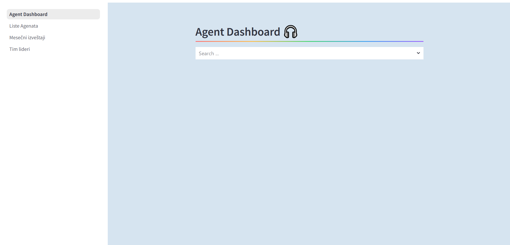
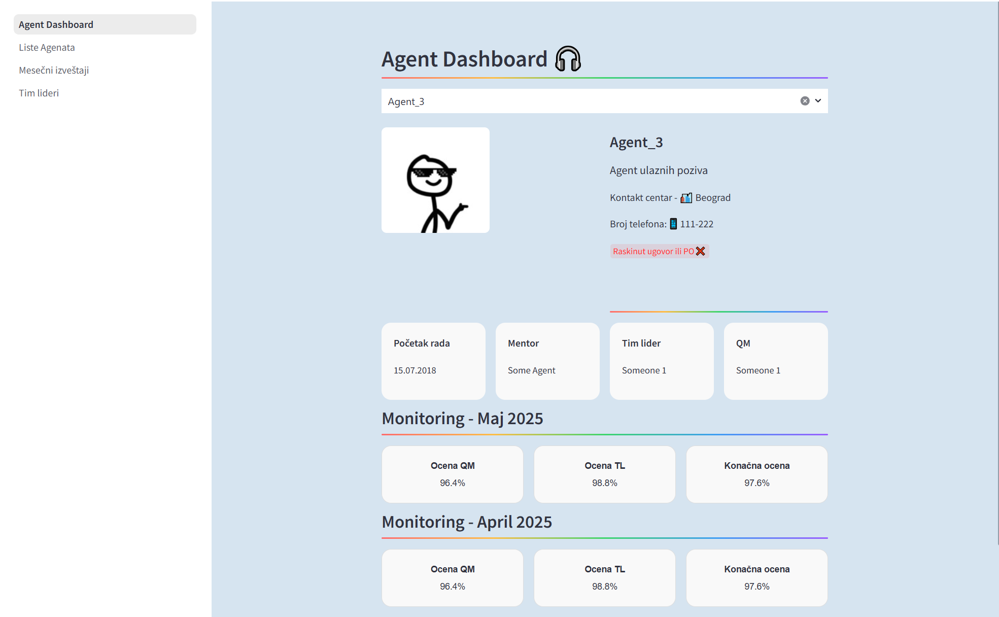
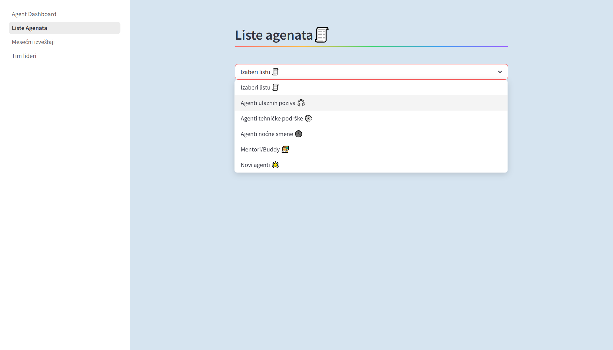
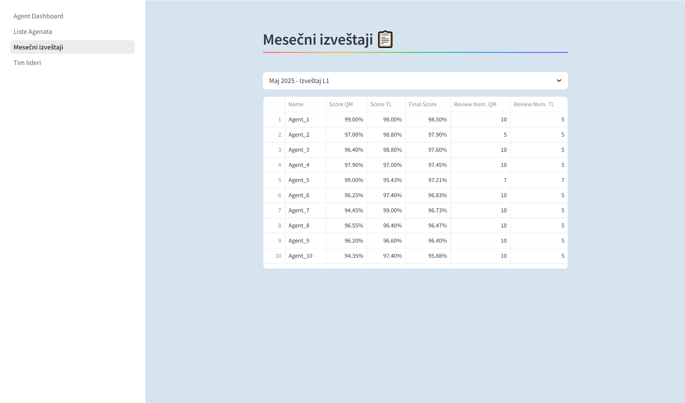

# 📊 Agent Dashboard (Streamlit)

This project is a **Streamlit dashboard** designed to help support teams easily access and display key information about call center agents. 
It includes agent details, performance monitoring, and team overviews — all in a simple, searchable interface.

---

## 💡 Motivation

This dashboard was created to solve a real internal problem:  
Team Leaders, Mentors, and QMs often had to waste time digging through spreadsheets or files to find agent info, monitoring results, or team details.

This app:
- Centralizes all relevant agent data  
- Reduces time spent searching  
- Helps improve visibility of agent performance  
- Encourages data-driven support and coaching  

What used to take several clicks or file lookups now takes seconds.

---
## 📝 Notes

-💾 All data is stored locally and updated manually each month.

-🔒 The app does not expose personal or sensitive user data (Files provided are mockups).

-🧪 Primarily designed for internal use by supervisors, QMs, and TLs.

-🎯 Built as a practical tool to improve visibility and save time in agent support operations.

-🌐 Language used in app is Serbian

-🛠️ Start it by running start.py

---

## 🚀 Features

### 🧑‍💼 Agent Info Page
Search for any agent using the **search box** to view:
- 📍 City they work in  
- ☎️ Contact number  
- 🎧 Position (inbound, outbound, etc.)  
- 🗓️ Start date  
- 🧑‍🏫 Mentor  
- 👨‍💼 Team Leader (TL)  
- 📋 Quality Manager (QM)  
- 📈 Monthly QM scores with visuals  

---

### 🗂️ Monthly Reports Page
- View a **list of all monthly monitoring reports**.
- Reports are organized and easy to filter.

---

### 🧮 Agent List Page
- See agents filtered by:
  - ✅ Position
  - 🟢 Status (e.g., active/inactive)
  - 🕵️ Other useful attributes

---

### 👥 Team Leader Overview
- Lists all **Team Leaders**
- Shows all agents assigned to each team

---

## 🛠️ Built With

- [Streamlit](https://streamlit.io/)
- [Pandas](https://pandas.pydata.org/)
- Python standard libraries
- Local `.xlsx` files or SQLite database (if configured)

---

## 📸 Screenshots

